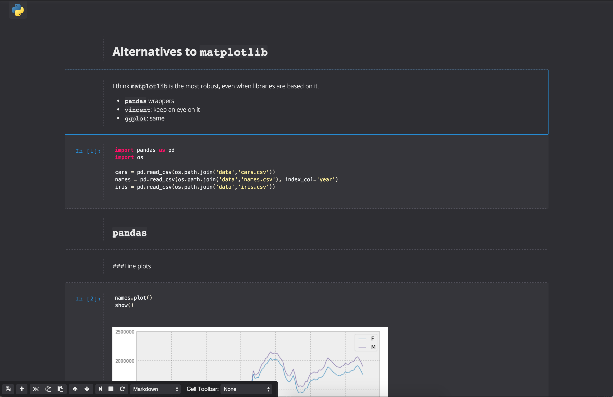
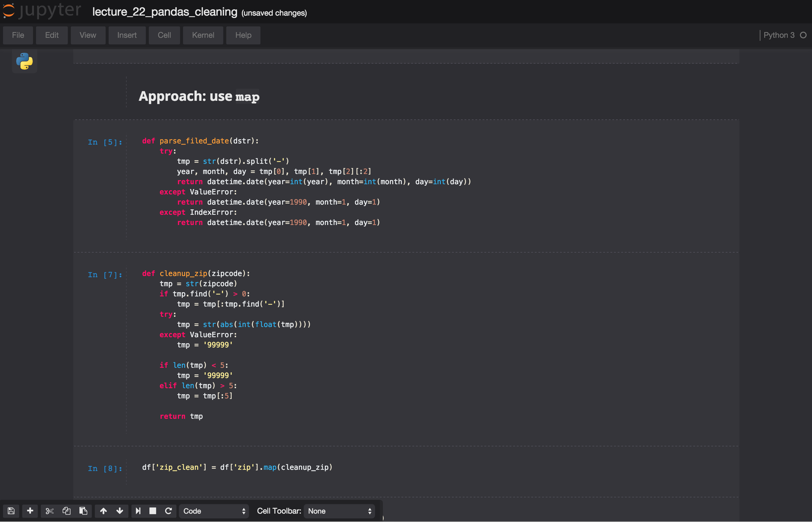

# Tonic Jupyter Theme
A dark Jupyter/iPython notebook theme.

## Install
### Jupyter <4.0
Put the `custom.css` file in the folder `~/.ipython/profile_default/static/custom/`.
You probable have to create the `static` and `custom` folders.

### Jupyter >4.0
Jupyter got updated, the new location for the `custom.css` is `~/.jupyter/custom/custom.css`.
You have to create the `custom` folder.

## Screenshots

If you hover over the Python logo the menus slide down.

Notebooks used in screenshots: 
[Alternatives to Matplotlib](http://nbviewer.ipython.org/github/ResearchComputing/Meetup-Fall-2013/blob/master/python/lecture_19_alternatives.ipynb)
[Pandas Cleaning Data](http://nbviewer.ipython.org/github/ResearchComputing/Meetup-Fall-2013/blob/master/python/lecture_22_pandas_cleaning.ipynb)

